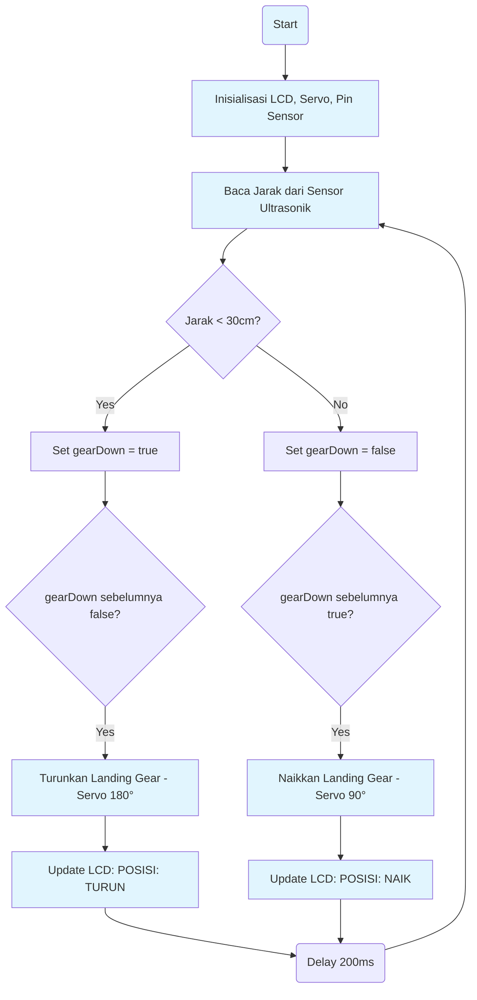

<h1 align="center">✈️ SISTEM LANDING GEAR OTOMATIS</h1>
<p align="center"> </p>
<p align="center"> <em>Sistem prototipe landing gear pesawat yang otomatis naik/turun berdasarkan deteksi jarak menggunakan sensor ultrasonik dan Arduino.</em></p>
<p align="center">
  
  
  
  
  
  <a href="https://github.com/yourusername/landing-gear-project/blob/main/LICENSE">
    
  </a>
</p>

---

## 📑 Table of Contents
- [✨ Overview](#-overview)
- [🚀 Fitur](#-fitur)
- [🏗️ Arsitektur Sistem](#️-arsitektur-sistem)
- [🛠 Komponen](#-komponen)
- [📁 Struktur File](#-struktur-file)
- [⚙️ Instalasi](#️-instalasi)
- [🚀 Cara Menjalankan](#-cara-menjalankan)
- [🐞 Troubleshooting](#-troubleshooting)
- [🤝 Kontribusi](#-kontribusi)
- [👨‍💻 Pengembang](#-pengembang)
- [📄 Lisensi](#-lisensi)

---

## ✨ Overview
**Sistem Landing Gear Otomatis** adalah prototipe yang mensimulasikan mekanisme landing gear pada pesawat terbang. Sistem ini menggunakan sensor ultrasonik untuk mendeteksi jarak ke permukaan (misalnya, landasan pacu) dan secara otomatis mengontrol servo motor untuk menaikkan atau menurunkan roda pendaratan. Status posisi roda akan ditampilkan pada layar LCD I2C.

### 🎯 Tujuan Proyek
- **Otomatisasi** - Mengembangkan sistem yang dapat beroperasi secara mandiri.
- **Edukasi Elektronika** - Platform pembelajaran dasar mikrokontroler, sensor, dan aktuator.
- **Simulasi** - Memberikan pemahaman dasar tentang mekanisme landing gear pesawat.
- **Proyek Hobi** - Proyek yang menarik untuk penggemar elektronika dan robotika.

---

## 🚀 Fitur
- ✅ **Deteksi Jarak Otomatis** Menggunakan sensor ultrasonik HC-SR04 untuk mengukur jarak secara real-time.
- ✅ **Kontrol Servo Motor** Menggerakkan 3 servo motor untuk meniru gerakan roda pendaratan (depan, belakang kiri, belakang kanan).
- ✅ **Indikator Status LCD** Menampilkan status "TURUN" atau "NAIK" pada layar LCD 16x2 I2C.
- ✅ **Responsif** Mengubah posisi landing gear secara cepat berdasarkan perubahan jarak.
- ✅ **Open Source** Sistem berbasis open source, ideal untuk pembelajaran dan modifikasi.

---

## 🏗️ Arsitektur Sistem
### 🔗 Diagram Blok Hardware/Software
```text
┌──────────────────┐     ┌───────────────────┐      ┌───────────────────┐
│Sensor Ultrasonik │────►│   Arduino/ESP32   │─────►│    Servo Motor    │
│   (HC-SR04)      │     │ (Mikrokontroler)  │      │       Depan       │
└──────────────────┘     │                   │      ├───────────────────┤
                         │                   │      │    Servo Motor    │
                         │                   │      │   Belakang Kiri   │
                         │                   │      ├───────────────────┤
                         │                   │      │    Servo Motor    │
                         │                   │      │   Belakang Kanan  │
                         ├───────────────────┤      └───────────────────┘
                         │    LCD I2C 16x2   │
                         │ (Tampilan Status) │
                         └───────────────────┘
```

### 📊 Flowchart Sistem


---

## 🛠 Komponen
### 📦 Perangkat Keras
| Komponen | Spesifikasi | Quantity | Pin Connection | Fungsi |
|----------|-------------|----------|----------------|---------|

| **Arduino/ESP32** | Arduino Uno/Nano/ESP32 | 1 | - | Mikrokontroler utama |

| **Servo Motor** | SG90/MG90S | 3 | 10, 9, 11 | Aktuator jari |

| **Sensor Ultrasonik** | HC-SR04 | 1 | Trig: 12, Echo: 13 | Deteksi jarak |

| **LCD I2C** | 16x2, Address 0x27 | 1 | SDA, SCL (A4, A5 pada Uno) | Menampilkan status |

| **Jumper Wires** | Male-Male, Male-Female | ~10 | - | Koneksi |

| **Breadboard** | Opsional | 1 | - | Memudahkan wiring |

| **Power Supply** | 5V (dari Arduino/eksternal) | 1 | - | Catu daya |

### 💻 Perangkat Lunak
| Software | Version | Fungsi |
|----------|---------|---------|
| **Arduino IDE** | 1.8+ atau 2.0+ | Lingkungan pemrograman |
| **Wire Library** | Built-in | Komunikasi I2C |
| **LiquidCrystal_I2C Library** | Latest | Kontrol LCD I2C |
| **Servo Library** | Built-in | Kontrol servo motor |

---

## 📁 Struktur File
```text
landing-gear-project/
├── 📄 README.md             # Dokumentasi proyek
└── 🤖 landing_gear_auto.ino # Kode utama Arduino
```

---

## ⚙️ Instalasi
### 1. 🔧 Clone Repository
\`\`\`bash
git clone https://github.com/yourusername/landing-gear-project.git
cd landing-gear-project
\`\`\`
*(Ganti \`yourusername\` dengan username GitHub Anda dan \`landing-gear-project\` dengan nama repositori Anda)*

### 2. 💻 Setup Arduino IDE
1.  **Download Arduino IDE** dari [arduino.cc](https://www.arduino.cc/en/software).
2.  **Install Board Package**:
    *   Untuk Arduino Uno/Nano: Biasanya sudah terinstal.
    *   Untuk ESP32: Ikuti panduan instalasi board ESP32 di Arduino IDE (File > Preferences > Additional Boards Manager URLs).
3.  **Install Libraries**:
    *   Buka Arduino IDE.
    *   Pergi ke \`Sketch > Include Library > Manage Libraries...\`
    *   Cari dan instal:
        *   \`LiquidCrystal I2C\` oleh Frank de Brabander
        *   \`Servo\` (biasanya sudah terinstal)
        *   \`Wire\` (biasanya sudah terinstal)

### 3. 🔌 Hardware Assembly
#### Wiring Diagram
<p align="center"> </p>

#### Pin Connections
\`\`\`text
Arduino/ESP32 Pin │ Komponen             │ Keterangan
──────────────────┼──────────────────────┼──────────────────────────
D12 (GPIO 12)     │ Trig Pin Ultrasonik  │ Output sinyal trigger
D13 (GPIO 13)     │ Echo Pin Ultrasonik  │ Input sinyal echo
D10 (GPIO 10)     │ Servo Depan (Signal) │ Kontrol servo depan
D9 (GPIO 9)       │ Servo Belakang Kiri  │ Kontrol servo belakang kiri
D11 (GPIO 11)     │ Servo Belakang Kanan │ Kontrol servo belakang kanan
SDA (A4 pada Uno) │ LCD I2C (SDA)        │ Data I2C
SCL (A5 pada Uno) │ LCD I2C (SCL)        │ Clock I2C
5V                │ VCC Ultrasonik, Servo│ Catu daya 5V
GND               │ GND Ultrasonik, Servo│ Ground
\`\`\`
*Catatan: Pastikan semua komponen memiliki ground yang sama. Untuk servo, disarankan menggunakan catu daya eksternal jika menggunakan banyak servo atau servo besar untuk menghindari kerusakan pada mikrokontroler.*

---

## 🚀 Cara Menjalankan
1.  **Buka Kode**: Buka file \`landing_gear_auto.ino\` di Arduino IDE.
2.  **Pilih Board**: Pergi ke \`Tools > Board\` dan pilih board Arduino/ESP32 yang Anda gunakan.
3.  **Pilih Port**: Pergi ke \`Tools > Port\` dan pilih port serial yang terhubung dengan mikrokontroler Anda.
4.  **Upload Kode**: Klik tombol \`Upload\` (panah kanan) di Arduino IDE.
5.  **Monitor Serial (Opsional)**: Buka Serial Monitor (Baud Rate: 9600) untuk melihat output debug jika ada.
6.  **Uji Sistem**:
    *   Posisikan objek di depan sensor ultrasonik.
    *   Jika jarak kurang dari 30cm, servo akan bergerak ke posisi "TURUN" (180 derajat).
    *   Jika jarak 30cm atau lebih, servo akan bergerak ke posisi "NAIK" (90 derajat).
    *   Amati perubahan status pada layar LCD.

---

## 🐞 Troubleshooting
### ❌ Common Issues & Solutions
#### **1. LCD Tidak Menyala/Menampilkan Teks**
**Gejala:**
- Layar LCD kosong atau hanya kotak-kotak hitam.
- Tidak ada teks yang muncul.
**Solusi:**
- ✅ **Periksa Wiring I2C**: Pastikan pin SDA dan SCL terhubung dengan benar.
- ✅ **Periksa Alamat I2C**: Alamat default adalah \`0x27\`, tetapi beberapa modul menggunakan \`0x3F\`. Anda bisa menggunakan I2C Scanner sketch untuk menemukan alamat yang benar.
- ✅ **Sesuaikan Potensiometer**: Putar potensiometer kecil di bagian belakang modul LCD I2C untuk mengatur kontras.
- ✅ **Periksa Power**: Pastikan LCD mendapatkan daya 5V dan ground yang stabil.

#### **2. Servo Tidak Bergerak atau Bergerak Erratic**
**Gejala:**
- Servo tidak merespons.
- Gerakan servo tidak halus atau bergetar.
**Solusi:**
- ✅ **Periksa Wiring Servo**: Pastikan pin sinyal, VCC, dan GND terhubung dengan benar.
- ✅ **Catu Daya Eksternal**: Servo membutuhkan arus yang cukup. Jika menggunakan banyak servo atau servo besar, gunakan catu daya 5V eksternal terpisah untuk servo, bukan langsung dari Arduino. Pastikan GND Arduino dan GND catu daya servo terhubung.
- ✅ **Pin PWM**: Pastikan pin yang digunakan untuk servo adalah pin PWM (biasanya ditandai dengan \`~\` pada Arduino Uno).

#### **3. Sensor Ultrasonik Tidak Akurat/Tidak Membaca**
**Gejala:**
- Jarak yang ditampilkan tidak masuk akal.
- Sensor tidak mendeteksi objek.
**Solusi:**
- ✅ **Periksa Wiring Trig/Echo**: Pastikan pin Trig dan Echo terhubung ke pin yang benar pada mikrokontroler.
- ✅ **Periksa Power Sensor**: Pastikan sensor mendapatkan daya 5V dan ground yang stabil.
- ✅ **Lingkungan**: Hindari permukaan yang menyerap suara (kain, busa) atau terlalu reflektif (kaca).
- ✅ **Interferensi**: Jauhkan sensor dari sumber suara atau getaran lain.

#### **4. Kode Tidak Terupload**
**Gejala:**
- Error saat mengupload kode ke board.
- \`avrdude: stk500_getsync(): not in sync: resp=0x00\`
**Solusi:**
- ✅ **Pilih Port yang Benar**: Pastikan Anda memilih port serial yang benar di \`Tools > Port\`.
- ✅ **Pilih Board yang Benar**: Pastikan Anda memilih jenis board yang benar di \`Tools > Board\`.
- ✅ **Driver USB**: Pastikan driver USB untuk board Anda terinstal dengan benar.
- ✅ **Kabel USB**: Coba kabel USB lain.

---

## 🤝 Kontribusi
Kontribusi sangat diterima! Mari bersama-sama mengembangkan proyek ini.

### 📋 How to Contribute
1.  **🍴 Fork** repository ini
2.  **🌿 Create** feature branch (\`git checkout -b feature/new-feature\`)
3.  **💾 Commit** changes (\`git commit -m 'Add new feature'\`)
4.  **📤 Push** to branch (\`git push origin feature/new-feature\`)
5.  **🔄 Open** Pull Request

### 🎯 Areas for Contribution
- [ ] **Optimasi Kode** - Peningkatan efisiensi dan keandalan kode.
- [ ] **Integrasi Sensor Lain** - Tambahkan sensor jarak lain (misalnya, IR).
- [ ] **Kalibrasi Servo** - Implementasi kalibrasi servo otomatis.
- [ ] **Desain Mekanik** - Desain 3D untuk prototipe landing gear.
- [ ] **Dokumentasi** - Perbaikan dokumentasi dan penambahan tutorial.

### 🐛 Bug Reports
Gunakan GitHub Issues dengan informasi:
- Deskripsi bug yang jelas
- Steps to reproduce
- Expected vs actual behavior
- Environment (Board, Arduino IDE version, dll)
- Screenshots/video jika memungkinkan

---

## 👨‍💻 Pengembang
**[Nama Anda]**
- 🐙 GitHub: [@yourusername](https://github.com/yourusername)
- 🌐 Portfolio: [yourportfolio.com](https://yourportfolio.com) (Opsional)
- 📧 Email: youremail@example.com (Opsional)

### 🙏 Acknowledgments
- **Arduino Community** - Untuk platform dan library yang luar biasa.
- **Library Developers** - Untuk \`LiquidCrystal_I2C\` dan \`Servo\` libraries.

---

## 📄 Lisensi
Proyek ini dilisensikan di bawah **MIT License** - lihat file [LICENSE](LICENSE) untuk detail lengkap.
\`\`\`text
MIT License
Copyright (c) 2025 [Your Name/Organization]

Permission is hereby granted, free of charge, to any person obtaining a copy
of this software and associated documentation files (the "Software"), to deal
in the Software without restriction, including without limitation the rights
to use, copy, modify, merge, publish, distribute, sublicense, and/or sell
copies of the Software, and to permit persons to whom the Software is
furnished to do so, subject to the following conditions:

The above copyright notice and this permission notice shall be included in all
copies or substantial portions of the Software.

THE SOFTWARE IS PROVIDED "AS IS", WITHOUT WARRANTY OF ANY KIND, EXPRESS OR
IMPLIED, INCLUDING BUT NOT LIMITED TO THE WARRANTIES OF MERCHANTABILITY,
FITNESS FOR A PARTICULAR PURPOSE AND NONINFRINGEMENT. IN NO EVENT SHALL THE
AUTHORS OR COPYRIGHT HOLDERS BE LIABLE FOR ANY CLAIM, DAMAGES OR OTHER
LIABILITY, WHETHER IN AN ACTION OF CONTRACT, TORT OR OTHERWISE, ARISING FROM,
OUT OF OR IN CONNECTION WITH THE SOFTWARE OR THE USE OR OTHER DEALINGS IN THE
SOFTWARE.
\`\`\`

---
<div align="center">
**✈️ Otomatisasi Pendaratan dengan Presisi**
**⚡ Dibangun dengan Arduino, Ultrasonik & Servo**
**⭐ Star this repo if you like it!**
<p><a href="#top">⬆ Back on Top</a></p>
</div>
